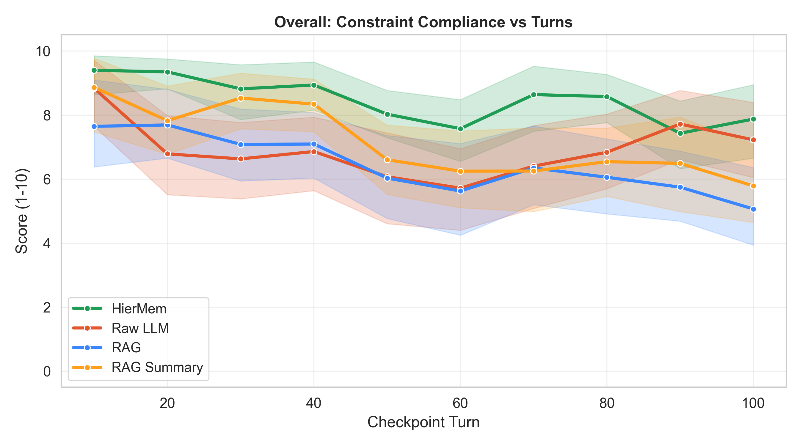
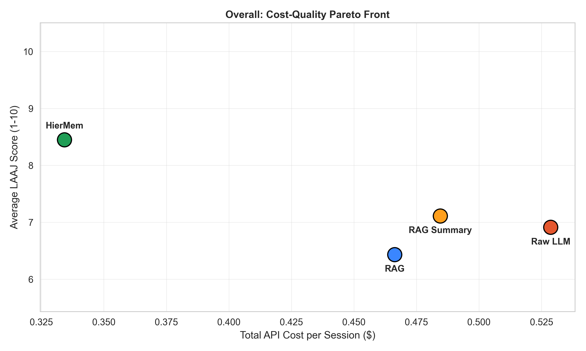
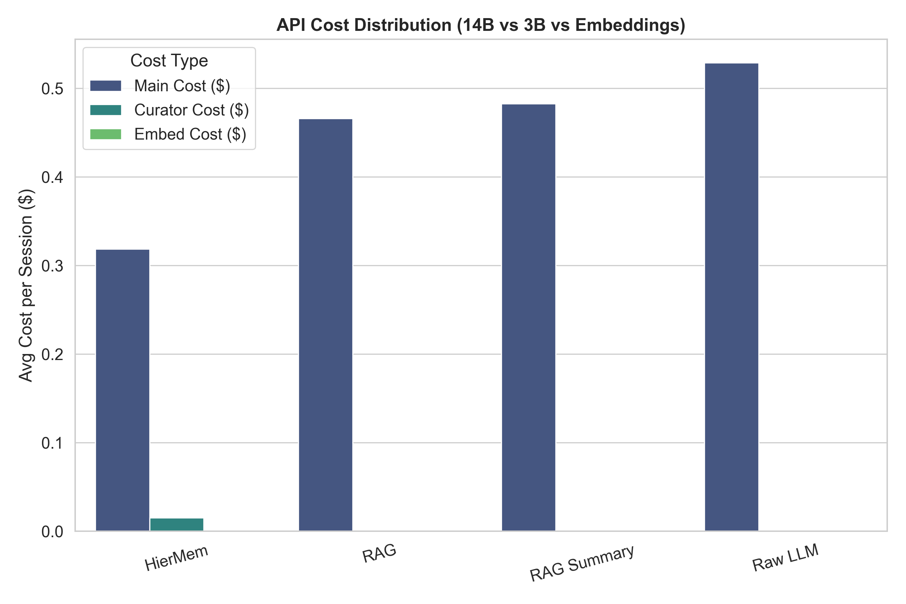
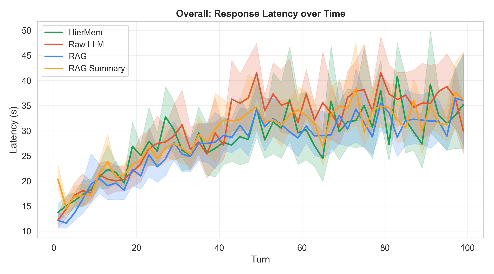

# HierMem

Hierarchical context management for long-horizon LLM conversations with explicit constraint preservation.

HierMem is a Python library that keeps conversation quality stable over long sessions by combining:
- a protected constraint store
- a four-level memory hierarchy
- a lightweight curator model for context selection

Current maturity: alpha research-grade runtime package with CLI and multi-provider support.

## Why HierMem

Long conversations degrade because critical constraints get buried or truncated. HierMem addresses this at the systems level.

Core ideas:
- Constraint-first prompt assembly: active rules always occupy a protected zone.
- Hierarchical memory: L0 topic index, L1 summaries, L2 embeddings, L3 raw turns.
- Curator orchestration: a smaller model selects what to retrieve, reducing expensive main-model context load.

Hybrid behavior note:
- Retrieval strategy (NONE/KEYWORD/HIERARCHY/SEMANTIC/HYBRID) is selected dynamically by the curator at runtime.
- Users do not need to manually select HYBRID for normal operation.
- The pipeline auto-switches between passthrough mode and curated mode based on token-threshold logic.

## Current Benchmark Snapshot (Architecture C, Qwen2.5-14B)

Source: [results/raw/benchmarks/qwen14b_arch_c/arch_metrics_research.json](results/raw/benchmarks/qwen14b_arch_c/arch_metrics_research.json) and per-dataset summaries.

Aggregate across 15 datasets:

| System | Mean Judge Score | Mean Compute Cost/Turn | Mean Session Compute Cost | Constraint Survival Rate |
|---|---:|---:|---:|---:|
| HierMem | 8.461 | 0.0176 | 0.881 | 0.933 |
| Raw LLM | 6.908 | 0.0264 | 1.322 | 0.740 |
| RAG | 6.439 | 0.0242 | 1.208 | 0.667 |
| RAG Summary | 7.148 | 0.0250 | 1.249 | 0.760 |

Computed deltas versus Raw LLM baseline:

| Metric | HierMem | Raw LLM | Delta |
|---|---:|---:|---:|
| Mean judge score | 8.461 | 6.908 | +1.553 |
| Mean compute cost/turn | 0.0176 | 0.0264 | -33.3% |
| Mean session compute cost | 0.881 | 1.322 | -33.3% |
| Constraint survival | 0.933 | 0.740 | +0.193 |

## Evaluation Credibility (How Scores Were Produced)

These results are not arbitrary dashboard numbers. Quality and adherence were scored checkpoint-by-checkpoint using an explicit LLM-as-judge protocol.

Judge setup:
- Judge model: Gemini 3.1 Pro (Google AI Studio)
- Evaluation granularity: 10 checkpoints per conversation
- Systems compared per checkpoint: HierMem, Raw LLM, RAG, RAG Summary

Judge rubric (weighted):

| Sub-score | Weight | Meaning |
|---|---:|---|
| Constraint adherence | 0.50 | Whether active rules were followed |
| Response quality & accuracy | 0.30 | Correctness, technical usefulness, directness |
| Conversational coherence & memory | 0.20 | Cross-turn continuity and memory stability |

Prompt-level anti-gaming controls in the judge rubric include:
- Vagueness penalty for generic safe responses with low technical utility
- Domain drift penalty for invented or incorrect domain entities
- Fairness rule that gives partial credit when a system attempts logic but misses a domain-specific detail

Transparency artifacts:
- Judge prompt used in evaluations: [multi_system_judge_prompt.txt](multi_system_judge_prompt.txt)
- Paper snapshot code tag: https://github.com/yashdoke7/llm-hiermem/releases/tag/v1.0.0-paper
- Dataset release: https://huggingface.co/datasets/yashdoke7/hiermem-constraint-tracking

## Benchmark Graphs

Overall quality trend:



Overall Pareto frontier:



Overall cost breakdown:



Overall latency trend:



Representative plots:
- [Overall quality trend](results/raw/benchmarks/qwen14b_arch_c/publish_graphs/Overall_1_Quality.png)
- [Overall Pareto frontier](results/raw/benchmarks/qwen14b_arch_c/publish_graphs/Overall_3_Pareto.png)
- [Overall cost breakdown](results/raw/benchmarks/qwen14b_arch_c/publish_graphs/Overall_4_Cost_Breakdown.png)
- [Overall latency trend](results/raw/benchmarks/qwen14b_arch_c/publish_graphs/Overall_5_Latency_Trend.png)

## Installation

### From source (recommended right now)

```bash
git clone https://github.com/yashdoke7/llm-hiermem.git
cd llm-hiermem
python -m venv .venv
.venv/Scripts/activate
pip install -e .
```

### Optional extras

```bash
pip install -e .[eval]
pip install -e .[dev]
pip install -e .[demo]
```

## Quick Start

```python
from core.pipeline import HierMemPipeline

pipeline = HierMemPipeline.create()

r1 = pipeline.process_turn("Always answer in bullet points. What is Python?")
print(r1.assistant_response)

r2 = pipeline.process_turn("Now compare Python and Go for backend systems.")
print(r2.assistant_response)
```

## CLI

After installation:

```bash
hiermem config
hiermem chat
hiermem ask "Give me a 3-point summary of memory hierarchies"
```

CLI source: [cli.py](cli.py)

## Configuration

Primary configuration lives in [config.py](config.py). You can set values in environment variables or .env.

### Provider and model routing

| Variable | Purpose | Default |
|---|---|---|
| DEFAULT_PROVIDER | fallback provider | ollama |
| MAIN_PROVIDER | provider for response model | DEFAULT_PROVIDER |
| CURATOR_PROVIDER | provider for curator | DEFAULT_PROVIDER |
| SUMMARIZER_PROVIDER | provider for summarizer | CURATOR_PROVIDER |
| MAIN_LLM_MODEL | main generation model | ollama/llama3.1:8b |
| CURATOR_MODEL | curator model | ollama/qwen2.5:3b |
| SUMMARIZER_MODEL | summarizer model | ollama/qwen2.5:3b |
| OLLAMA_BASE_URL | Ollama endpoint | http://localhost:11434 |
| OLLAMA_CONTEXT_SIZE | Ollama max context | 8192 |
| OLLAMA_KEEP_ALIVE | keep model resident | 30m |

### Context and memory controls

| Variable | Purpose | Default |
|---|---|---|
| TOTAL_CONTEXT_BUDGET | base context budget | 8192 |
| HIERMEM_CONTEXT_BUDGET | HierMem budget override | TOTAL_CONTEXT_BUDGET |
| RAW_LLM_CONTEXT_BUDGET | raw baseline budget | TOTAL_CONTEXT_BUDGET |
| RAG_CONTEXT_BUDGET | RAG budget | TOTAL_CONTEXT_BUDGET |
| RAG_SUMMARY_CONTEXT_BUDGET | RAG Summary budget | TOTAL_CONTEXT_BUDGET |
| HIERMEM_PASSTHROUGH_THRESHOLD | optional explicit threshold | 0 (auto) |
| MAX_L0_ENTRIES | max segment directory entries | 20 |
| SEGMENT_SIZE | turns per archive segment | 10 |
| MAX_CONSTRAINTS | active constraints cap | 20 |

### Runtime/API credentials

| Variable | Required for |
|---|---|
| OPENAI_API_KEY | OpenAI |
| ANTHROPIC_API_KEY | Anthropic |
| GOOGLE_API_KEY | Google Gemini |
| GROQ_API_KEY | Groq |

## API Rate-Limit and Budget Notes

The library has proactive budget pacing in [llm/client.py](llm/client.py) through TokenBudget.

Built-in defaults used by provider adapters:
- Groq:
  - 70B or versatile-class models: 6000 TPM, 30 RPM
  - smaller models: up to 20000 TPM, 30 RPM
- OpenAI default pacing: 90000 TPM, 60 RPM
- Google Gemini pacing in code:
  - 2.5-class path: 250000 TPM, 5 RPM, 20 RPD
  - other Gemini path: 250000 TPM, 10 RPM
- Ollama: local mode, no API throttling

Important:
- Provider limits vary by plan/model and change over time.
- Treat code defaults as safety guards, not authoritative account limits.
- Verify current RPM/TPM/RPD directly in provider dashboards before large runs.

## Deployment Framing

HierMem is best treated as a memory-orchestration runtime library for long-horizon LLM apps.

It is not yet an IDE-agent integration product (for example, MCP tool ecosystem parity with code-review graph style integrations). If you are publishing this package today, position it as:
- a reusable pipeline + CLI for constraint-preserving conversations
- benchmark-backed architecture code
- local-first memory storage with configurable cloud/local inference providers

and not as a turnkey enterprise assistant platform.

## Operational Defaults That Matter

- Vector store reset on startup is disabled by default (`CLEAR_VECTOR_ON_START=false`).
- Archive state persists under `HIERMEM_STATE_DIR` by default.
- For clean benchmark reruns, set `CLEAR_VECTOR_ON_START=true`.
- Local data directories default to user-local storage (`HIERMEM_DATA_DIR`), with optional overrides via `CHROMA_DB_PATH` and `HIERMEM_STATE_DIR`.

## .env Example

Use [.env.example](.env.example) as a starting point.

Minimal local setup:

```env
DEFAULT_PROVIDER=ollama
MAIN_LLM_MODEL=ollama/qwen2.5:14b
CURATOR_MODEL=ollama/qwen2.5:3b
SUMMARIZER_MODEL=ollama/qwen2.5:3b
OLLAMA_BASE_URL=http://localhost:11434
OLLAMA_CONTEXT_SIZE=32768
OLLAMA_KEEP_ALIVE=30m
```

Hybrid setup (paid main model, local curator/summarizer):

```env
MAIN_PROVIDER=openai
OPENAI_API_KEY=sk-...
MAIN_LLM_MODEL=gpt-4o-mini
CURATOR_PROVIDER=ollama
CURATOR_MODEL=ollama/qwen2.5:3b
SUMMARIZER_PROVIDER=ollama
SUMMARIZER_MODEL=ollama/qwen2.5:3b
```

## Project Structure

- [core/pipeline.py](core/pipeline.py): main orchestration
- [core/curator.py](core/curator.py): retrieval decision model
- [core/assembler.py](core/assembler.py): zone-based context assembly
- [core/constraint_store.py](core/constraint_store.py): invariant constraint memory
- [core/post_processor.py](core/post_processor.py): extraction, violation check, archiving
- [memory/vector_store.py](memory/vector_store.py): Chroma wrapper
- [llm/client.py](llm/client.py): multi-provider client and rate budgeting
- [eval/run_benchmark.py](eval/run_benchmark.py): benchmark runner
- [eval/research_metrics.py](eval/research_metrics.py): metrics and research plots
- [eval/paper_plots.py](eval/paper_plots.py): publication-style figures
- [docs/ArchitectureDiagram.png](docs/ArchitectureDiagram.png): canonical architecture figure used in paper

## Testing

```bash
python -m pytest tests -v
```

## Research Paper

Draft manuscript:
- [docs/paper.tex](docs/paper.tex)

Claim scope note: current reported gains are from controlled synthetic benchmark conversations and should be interpreted as architecture-level evidence, not final proof of production generalization.

Overleaf-ready figures copied for paper:
- [docs/figures/overall_quality.png](docs/figures/overall_quality.png)
- [docs/figures/overall_pareto.png](docs/figures/overall_pareto.png)
- [docs/figures/overall_cost_breakdown.png](docs/figures/overall_cost_breakdown.png)
- [docs/figures/overall_latency_trend.png](docs/figures/overall_latency_trend.png)

Artifact links:
- Code release tag (paper snapshot): https://github.com/yashdoke7/llm-hiermem/releases/tag/v1.0.0-paper
- Dataset release (HF): https://huggingface.co/datasets/yashdoke7/hiermem-constraint-tracking

## PyPI Packaging and Release

Release checklist is documented in:
- [docs/pypi_deployment_guide.md](docs/pypi_deployment_guide.md)

Build locally:

```bash
python -m pip install build twine
python -m build
python -m twine check dist/*
```

## Citation

```bibtex
@software{doke2026hiermem,
  title={HierMem: Constraint-Preserving Hierarchical Context Management for Long-Horizon LLM Conversations},
  author={Yash Doke},
  year={2026},
  url={https://github.com/yashdoke7/llm-hiermem}
}
```

## License

MIT License. See [LICENSE](LICENSE).
